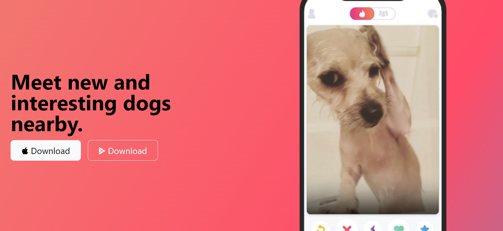

# TinDog Project

TinDog is a fictional web application built with HTML, CSS, and Bootstrap.

## Table of contents

- [Overview](#overview)
  - [Description](#description)
  - [Features](#features)
  - [Screenshot](#screenshot)
  - [Links](#links)
- [My process](#my-process)
  - [Built with](#built-with)
  - [What I learned](#what-i-learned)
- [Author](#author)

## Overview

### Description

TinDog is a fun and interactive platform designed to help dog owners find other dogs nearby, set up playdates, and socialize. The application offers a user-friendly interface and various subscription plans to suit different user needs.

### Features

- **Easy to Use:** Simplified interface for seamless navigation.
- **Elite Clientele:** Access to a wide network of dog owners.
- **Guaranteed Results:** Find the perfect match for your dog or get a refund.

### Screenshot

### Links

- Solution URL: [Solution URL](https://github.com/Neooo17/TinDog)
- Live Site URL: [Live site URL]()

## My process

### Built with

- Semantic HTML5 markup
- CSS custom properties
- BootStrap

### What I learned

This project allowed me to deepen my understanding of web development with HTML, CSS, and Bootstrap. I gained experience in creating a responsive and visually appealing web application.

## Author

- Website - [Neooo17](https://github.com/Neooo17)

